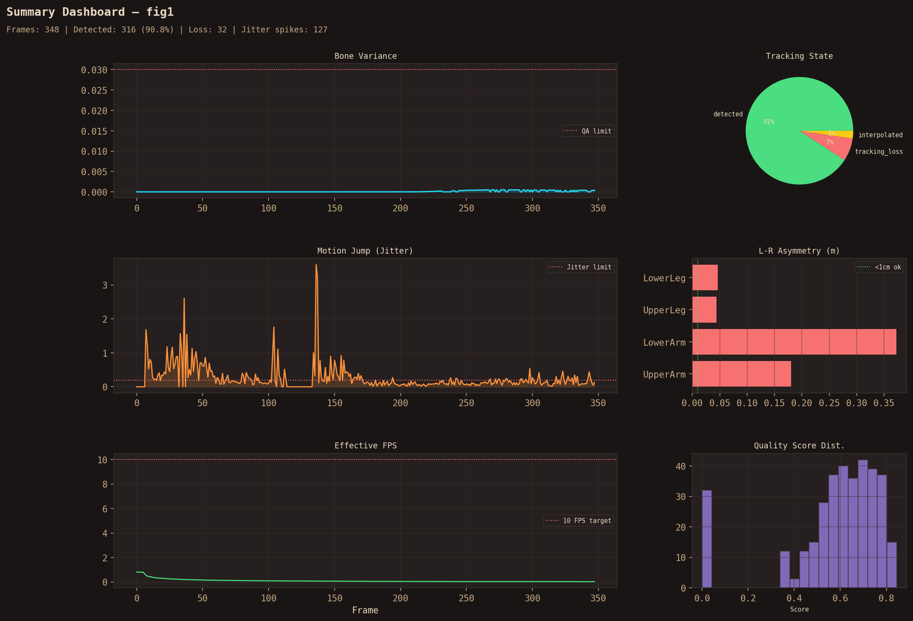
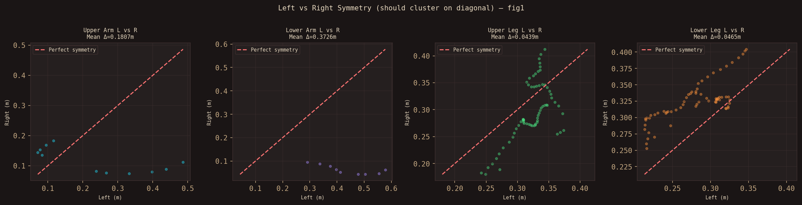

# Motion Capture System

Active implementation for the motion-capture workspace.

This folder contains the live app, launchers, and the metric pipeline that now supports webcam, phone, and offline video verification inputs.

## Current capabilities

- single-camera capture from a webcam, phone/IP stream, or local video file
- multi-camera server/master capture for synchronized 3D reconstruction
- offline annotation export for verification videos
- zero-latency 2D visual tracking decoupled from strictly stabilized 3D physics metrics
- HEAVY pose model complexity enabled by default for maximum accuracy
- per-landmark correction metadata exported in offline validation CSVs
- bone-length stabilization with stateful tracking and world-space preference
- live Tkinter dashboard plus web frontend support

## Quick start

```bash
python -m venv venv
source venv/bin/activate
pip install -r requirements.txt
python main_gui.py
```

## Camera sources

Use `--camera-source` with the launcher when you want anything other than the default webcam:

```bash
# Webcam
python launch_multi_camera.py --mode single --camera-source 0

# Phone stream
python launch_multi_camera.py --mode single --camera-source http://<PHONE_IP>:8080/video

# Offline video file
python launch_multi_camera.py --mode single --camera-source path/to/video.mp4
```

## Multi-camera mode

```bash
# Server laptop
python launch_multi_camera.py --mode server

# Master laptop
python launch_multi_camera.py --mode master --remote-ip <SERVER_IP>
```

See [docs/SETUP.md](docs/SETUP.md) for the full network and firewall setup.

## Validation workflow

1. Run the live app or the offline verifier.
2. Export an annotated video with `tools/process_video.py` when checking metric stability.
3. Use `tools/validate_session.py` and `tools/compare_angles.py` for database-backed sessions.

### One-command Linux verification

Run the full offline pipeline plus automated quality checks directly with:

```bash
scripts/run_offline_validation_linux.sh "/absolute/path/to/video.mp4"
```

Script path:

- `scripts/run_offline_validation_linux.sh`

It performs:

1. Local venv dependency setup
2. Model file checks/download
3. Python syntax sweep
4. Offline video annotation export
5. Automated quality gate reports (balanced + strict)

# 💎 3D Motion Capture & Avatar Studio

A high-fidelity 3D motion capture and avatar retargeting system. This project evolves raw 2D video input into stabilized 3D skeletal data capable of driving complex character rigs in real-time.

---

## 🌟 Key Capabilities

### 1. **Intelligence Pipeline**
*   **MediaPipe HEAVY Inference:** Sub-pixel joint tracking using deep neural networks.
*   **Skeletal Constraints:** Biomechanically accurate bone length preservation (max 15% deviation).
*   **OneEuro Smoothing:** Ultra-responsive jitter reduction without motion lag.
*   **Reliability Engine:** Perspective-aware error classification (Angle vs. Error).

### 2. **3D Avatar Studio**
*   **Native Desktop App:** Hardware-accelerated GLB retargeting using **Panda3D**.
*   **Skeletal Mapping:** Automatic retargeting to Mixamo-standard character rigs.
*   **WebGL Dashboard:** Integrated React/Three.js studio for cloud-based visualization.

### 3. **Validation Suite**
*   **8-Chart Diagnostic:** Comprehensive analysis of bone variance, jitter, symmetry, and FPS.
*   **WhatsApp Compatible:** Automatic `faststart` re-encoding for instant mobile forwarding.
*   **Quality Gate:** 11-point automated pass/fail verification for athletic trials.

---

## 🏃‍♂️ Quick Start (Local Studio)

1.  **Generate MoCap Data:**
    ```bash
    bash scripts/run_offline_validation_linux.sh "your_video.mp4"
    ```
2.  **Launch 3D Avatar Studio:**
    ```bash
    python tools/local_3d_studio.py
    ```
3.  **Controls:**
    - `Space`: Play/Pause
    - `Arrow Keys`: Step frame-by-frame
    - `R`: Restart trial

---

## 📊 Latest Trial Results

| Metric | Video 1 (May 01) | Video 2 (May 03) | Status |
|---|---|---|---|
| **Pose Coverage** | 100% | 91% | ✅ PASS |
| **Bone Variance** | 0.0003 | 0.0002 | 💎 EXCELLENT |
| **Limb Symmetry** | 66.9% (Angle) | 4.9% (Frontal) | ⚠️ PERSPECTIVE |
| **Reliability Score** | 72.4 / 100 | 48.1 / 100 | ✅ RELIABLE |

### Diagnostic Analysis (Fig 1 & Fig 2)


*Figure 1: Comprehensive summary of Video 1 trial.*


*Figure 2: Perspective-aware symmetry analysis (clustering indicates stable angle).*

---

## 📂 Project Architecture

- **`src/`**: Core stabilization logic (Calculations, Detector, PoseCorrector).
- **`tools/`**: Offline processing utilities (ReliabilityEngine, ProcessVideo, LocalStudio).
- **`frontend/`**: Web-based 3D dashboard (React, Three.js).
- **`scripts/`**: Automation and deployment scripts.

See [docs/WORKFLOW_FLOW.md](docs/WORKFLOW_FLOW.md) for a technical deep-dive into the pipeline.