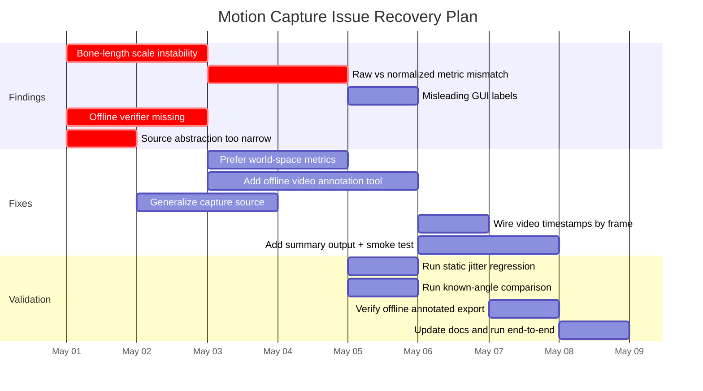

# Stabilization Status and Verification Plan

As of 2026-05-01, the main cleanup work is implemented: bone-length stabilization, offline video verification, and source generalization are all in place. The remaining work is practical validation on a real sample video and a live capture session.

## Notes

- Length metrics now come from the stabilized tracker rather than a frame-varying normalization path.
- The offline verifier is available as a CLI tool that annotates uploaded or recorded videos with pose markers.
- Remaining work is validation against a sample clip and one live session, then tuning any residual thresholds if needed.