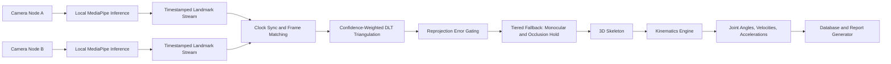
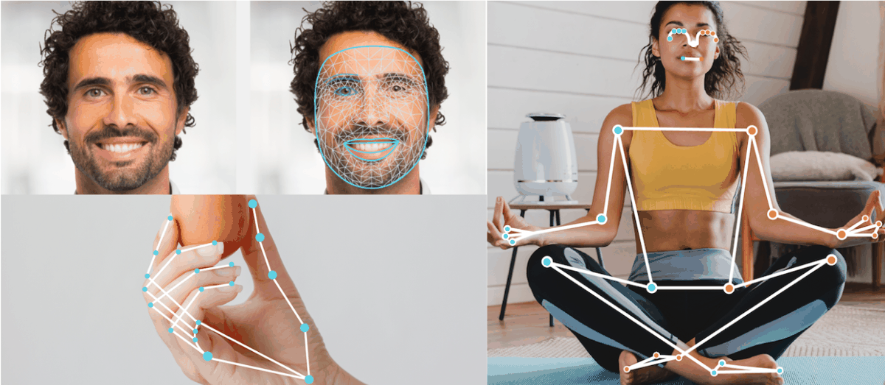
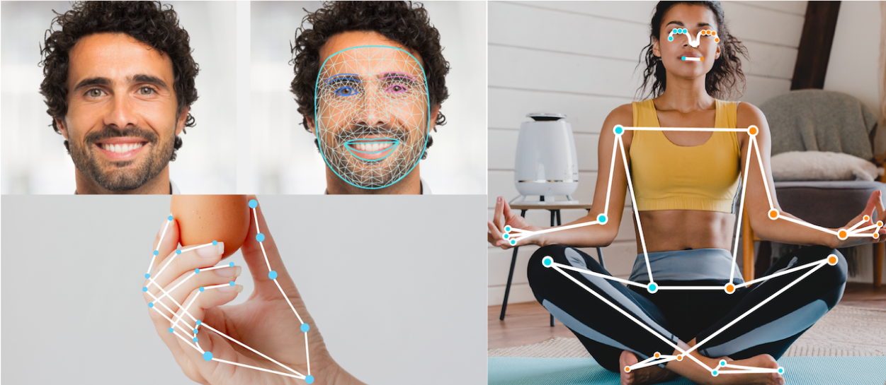
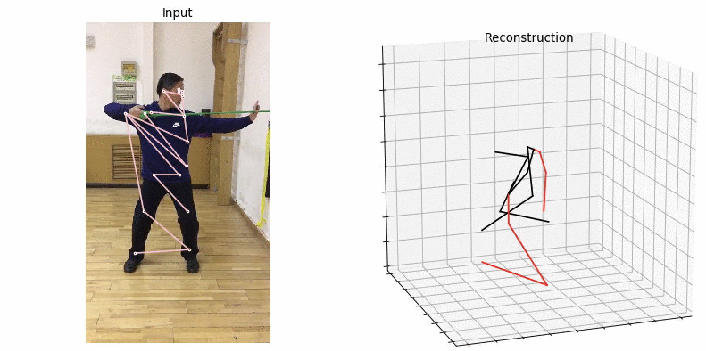
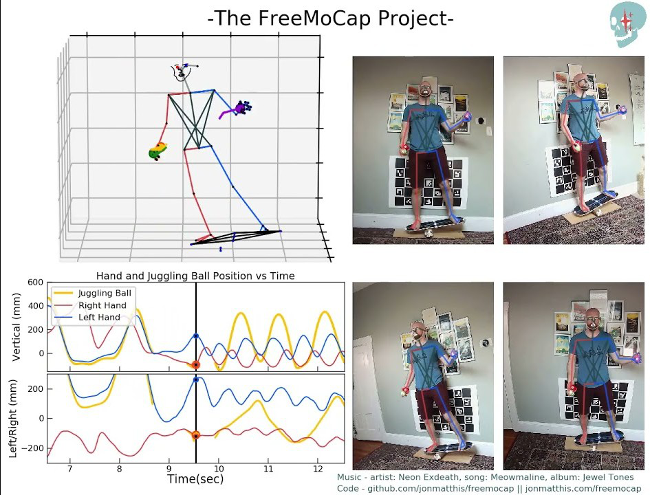
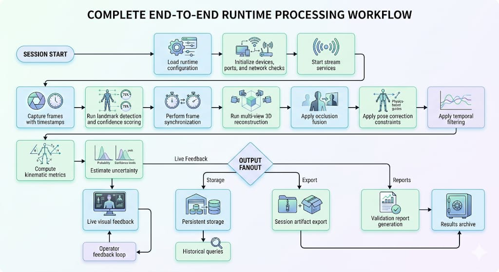
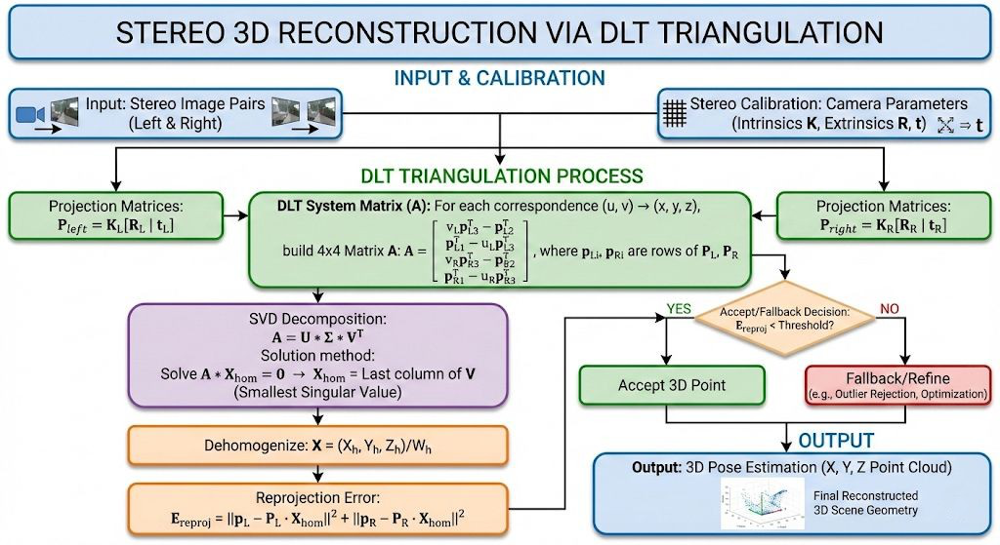
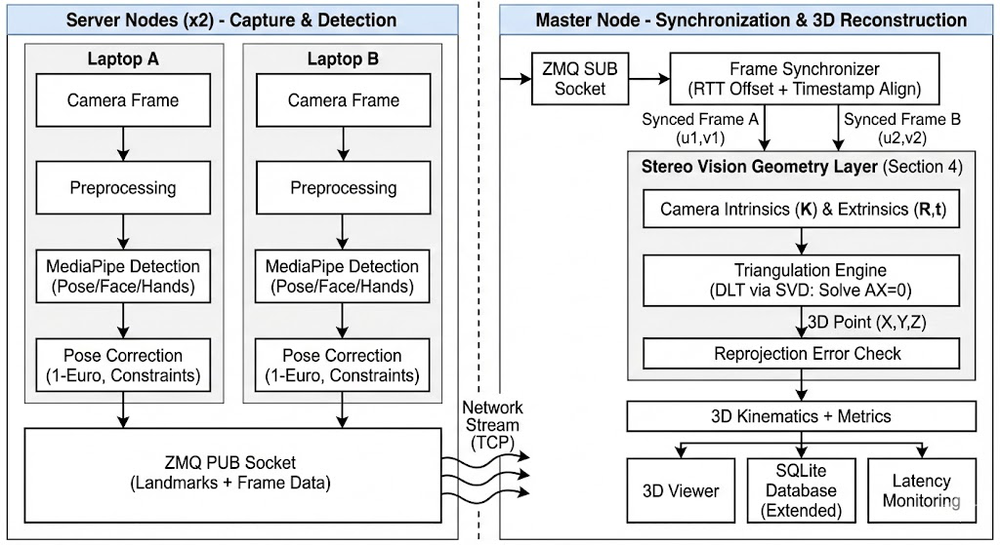

# Motion-Capture-System

Real-time multi-camera markerless motion capture and kinematic analysis pipeline built for commodity hardware.

This repository documents and tracks the flagship motion-capture work using architecture updates from:

- `E:\main_architecture_update_20260310\untitled-3.pdf`

## Project Summary

This system performs synchronized multi-view 2D landmark capture, confidence-weighted stereo triangulation, and real-time kinematic analytics. It is designed to reduce monocular depth ambiguity and improve robustness under occlusion without requiring marker suits or specialized motion-capture labs.

Core goals:

- real-time 3D joint reconstruction from multiple RGB cameras
- timestamp synchronization over standard Wi-Fi
- graceful degradation when one view drops or landmarks are low-confidence
- live biomechanical metrics (joint angles, velocity, acceleration)

## Architecture Diagram

Mermaid source: [docs/architecture.mmd](docs/architecture.mmd)

## Architecture GIF and Screenshots

### Architecture GIF

### Key Figures

### Results Visuals

## README Explanation

### 1. Acquisition and Synchronization

- Multi-camera nodes run independent local inference.
- Frames are aligned via software clock-offset correction and nearest-frame matching.
- A bounded sync window (20-30 ms) is used to tolerate realistic Wi-Fi jitter.

### 2. 3D Reconstruction

- Landmarks are triangulated using confidence-weighted DLT.
- Reprojection residual checks gate unreliable triangulations.
- Fallback tiers preserve continuity when one camera drops or landmarks are occluded.

### 3. Kinematic Analytics

- Real-time computation of joint angles, segment lengths, linear/angular velocity, and acceleration.
- Session metrics are persisted for post-run analysis and reporting.

## Reported Results (from architecture update document)

Consolidated evaluation highlights:

- Throughput: 14.47 FPS mean, 29.91 FPS P95
- End-to-end latency: 84.37 ms mean, 138.11 ms P95
- Triangulation stage: approximately 1.4 ms per frame
- Frame-to-frame jitter: 12.4 ms

These indicate practical real-time behavior for long continuous capture sessions on commodity devices.

## Repository Structure

The repository root is the flagship documentation entry point. Implementation modules currently exist in:

- `Motion-capture/`
- `Motion-capture-vs1/`

Supporting documentation and visuals added at root-level:

- `docs/architecture.mmd`
- `docs/assets/`
- `docs/screenshots/`

## Quick Start

1. Install dependencies in the implementation folder you want to run.
2. Configure camera endpoints and calibration values.
3. Launch capture/coordinator scripts.
4. Validate session outputs and generated reports.

## Next Improvements

- Add a single root-level launcher to remove ambiguity between implementation variants.
- Add fixed benchmark scripts for reproducible latency/FPS reporting.
- Add curated demo GIFs from live capture sessions in addition to architecture-derived visuals.